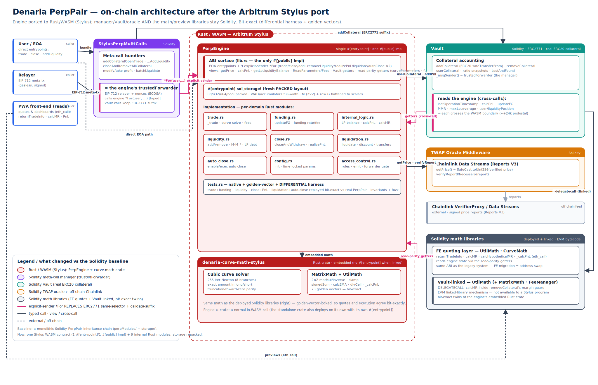

# Architecture

Denaria's current smart-contract system is a hybrid Arbitrum stack. The execution-heavy
perp engine is a Rust/Arbitrum Stylus program, while custody, account abstraction,
oracle verification, and quote-oriented math remain Solidity. On the production trade
path the Stylus engine is **~11% (≈58–61k L2 gas) cheaper** than the Solidity baseline
with bit-exact identical output — see [GAS_BENCHMARKS.md](GAS_BENCHMARKS.md).

## Current Topology

| Layer | Component | Language | Responsibility |
| --- | --- | --- | --- |
| Perp engine | `perp-engine` / `PerpEngine` | Rust / Stylus WASM | Stateful trade, close, liquidity, liquidation, funding, auto-close, access-control, and configuration paths |
| Meta-call manager | `StylusPerpMultiCalls` | Solidity | EIP-712 request hashing, relayer nonces, bundled user workflows, and explicit-sender forwarding into the engine |
| Collateral custody | `Vault` | Solidity | Stablecoin deposits, withdrawals, collateral accounting, PnL settlement, and margin-safety checks |
| Recovery | `LostAndFound` | Solidity | Custody for transfers that cannot be delivered to a user |
| Oracle | `TWAPOracleMiddleware` | Solidity | Chainlink Data Streams report verification, freshness checks, and TWAP volatility checks |
| Quote/math layer | `CurveMath`, `MatrixMath`, `UtilMath`, `FeeManager` | Solidity libraries | Front-end quote reads and Vault collateral-ratio helpers |
| Rust math crate | `denaria-curve-math-stylus` | Rust | Bit-exact CurveMath/MatrixMath/UtilMath routines embedded into the Stylus engine |
| Reference engine | `PerpPair.sol` + `perpModules/` | Solidity | Regression and differential-test reference, not the current deploy target |

## Why The Solidity Math Libraries Remain

The Stylus migration moved the stateful engine and write paths to WASM. The Solidity
math libraries remain because they have two production roles that are better served as
EVM bytecode:

1. The front-end quote path uses `UtilMath` and `CurveMath` as read-only `eth_call`
   targets. Keeping that ABI stable avoids duplicating preview logic in the
   size-constrained Stylus engine.
2. `Vault` still links `UtilMath` for collateral-ratio helpers (EVM library linking uses
   `DELEGATECALL`, which a Stylus program cannot provide).

The Vault's collateral-removal margin check no longer fans out through `UtilMath.calcMR`.
It now reads a single consolidated `marginCheckData` view from the engine — the margin
ratio plus the raw position/liquidity fields it needs — and applies the bad-debt guard
locally, replacing roughly a dozen separate reads into the engine with one. `UtilMath.calcMR`
is retained for the front-end quote path and as the differential reference.

The Rust engine embeds the same math internally for execution. Golden-vector and
differential tests lock the Rust routines against the Solidity libraries.

## Stylus Engine Design

`perp-engine/src/lib.rs` defines the single public ABI surface and the Stylus storage
layout. Domain modules implement the state transitions:

- `trade.rs`
- `close.rs`
- `liquidity.rs`
- `liquidation.rs`
- `funding.rs`
- `auto_close.rs`
- `config.rs`
- `access_control.rs`
- `internal_logic.rs`

The engine uses a fresh packed storage layout rather than mirroring Solidity storage
slot-for-slot. Narrowed fields are restricted to values whose protocol ranges fit the
target integer width; WAD-scale and accumulating quantities remain full-width.

## Arithmetic Overflow Parity

Solidity 0.8 reverts on arithmetic overflow. The deployable WASM is built with
`overflow-checks` off, and the underlying integer types wrap silently there rather than
trap: `ruint` (`U256`) maps `+ - *` to unconditional `wrapping_*`, and `alloy` (`I256`)
only traps under `debug-assertions`. Toggling the `overflow-checks` or `debug-assertions`
profile flags does **not** restore the reverting behaviour for both types, so it is not a
substitute for explicit checks.

Because of this, the fund-critical fixed-point primitives in the Rust math crate use
explicit checked arithmetic instead of the raw operators. The Q80 adjugate
snapshot-recovery routines (`recover_lp_balance_from_snapshot`,
`recover_funding_star_from_snapshot`) and the overflow-safe signed division
(`sum_mul_div_signed`, `positive_determinant_fixed`) route every multiply/add/subtract/
negate through checked helpers that return an `Error("MOV")` revert on overflow. This
matches the Solidity reference's revert-on-overflow: an intermediate in the recovery fast
path can grow large for a deep pool, and a silent wrap there would hand back a corrupted
LP or funding balance instead of reverting. In the normal (non-overflow) operating range
the checked helpers are value-identical to the raw operators, so the golden-vector
differential against the Solidity reference remains bit-exact.

## Configuration Events

The engine emits configuration-update events — `ParametersUpdated` and
`LockedParameterUpdate` — so off-chain indexers and dashboards can observe parameter
changes. They are retained deliberately: the engine is bounded by WASM activation size,
not the 24 KB EVM bytecode limit (EIP-170), so there is no size pressure to drop them.
If a future raw-WASM size reduction is ever required, these two events are low-risk
removal candidates; dropping them would also align the engine's event surface with the
size-optimized Solidity build.

## Solidity Periphery

`StylusPerpMultiCalls` is the deployed manager for bundled and relayed flows. It forwards
to explicit-sender engine entrypoints such as `tradeFor`, `closeAndWithdrawFor`, and
liquidity-management variants. The manager is the engine's trusted forwarder.

`Vault` holds real stablecoins and calls back into the engine for read-only risk data.
The Vault does not implement perp state transitions; it only manages real collateral and
settles realized PnL when called by the configured engine.

`TWAPOracleMiddleware` wraps Chainlink Data Streams reports. A caller can submit a fresh
signed report to `verifyReportIfNecessary(bytes)`, after which `getPrice()` serves the
stored price only if freshness, expiry, feed ID, and TWAP checks pass.

## Legacy Code Policy

`PerpPair.sol` remains in `src/` because it is the canonical Solidity reference used by
tests, fixtures, and differential checks. It is intentionally retained as verification
infrastructure.

The old intermediate adapter topology (`PerpPairStylus` plus `CurveMathStylus`) was
removed. Curve math is now embedded in the monolithic Stylus engine, and deployed quote
paths use the Solidity libraries.
